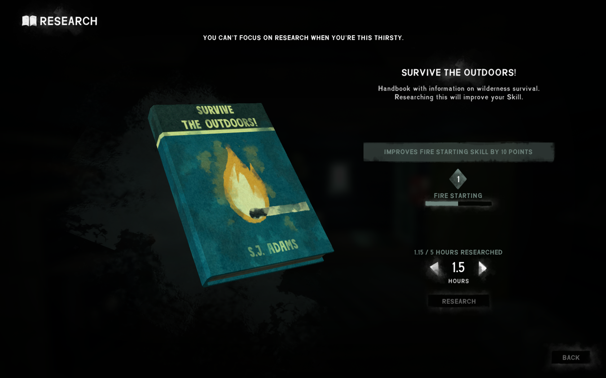

# RESEARCH BOOK TWEAKER

* Allows you to research for shorter amounts of time *[ShorterReadingIntervals feature]*
* Lets you interrupt research at any time without losing progress. *[ShorterReadingIntervals feature]*
* Allows you to tweak the time requirement and the amount of points earned for each book type
* Allows you to set the level at which **Frontier Shooting Guide** *(beginner's book for rifle shooting)* ceases to provide points.
* Allows you to reread a book indefinitely
* *It means you could set time and points earned at fairly low value and use research books more like a pass time activity.*

## KNOWN ISSUES
* **Shorter Reading Intervals** features doesn't work with **Settled Mind** feat
* If you cancel reading too close to the end of the book, the book will be complete anyway.

Half-hour increments:

Interrupted research still counts:

## CREDITS
Original mod by **zeobiouslyfakeacc**

